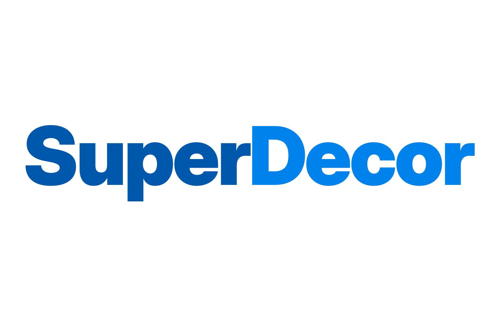

  

**SuperDecor** is a decoration framework for **Supermarket Simulator**. It gives players and creators the tools to build the store they want, turning the game into a creative sandbox with a public API for expansion content.

Items can be simple static props, animated decor like a spinning sign or a working clock, or interactive pieces that respond to the player. It's compatible with the IL2CPP version of the game.

This repo is mostly for creators who want to make expansion content for SuperDecor. My goal is to make it as easy as possible for anyone to create their own SuperDecor packs for release on Nexus or for personal use.

| What | Where |
|---|---|
| **Expansion Pack Generator**, turn a 3D model into a drop-in decor pack with no code | **[Open the tool](https://leptoon.github.io/superdecor-release/)** *(live)* |
| **SuperDecor mod**, downloadable builds (also on [Nexus Mods](https://www.nexusmods.com/supermarketsimulator/mods/1225)) | [Releases](https://github.com/leptoon/superdecor-release/releases) |
| **First-party decor content**, official packs by Leptoon (none yet) | [`packs/`](packs/) and [Releases](https://github.com/leptoon/superdecor-release/releases) |

> **SuperDecor runs on the current version of Supermarket Simulator (Unity 6, IL2CPP).** Download it from
> the [Releases](https://github.com/leptoon/superdecor-release/releases) page or from
> [Nexus Mods](https://www.nexusmods.com/supermarketsimulator/mods/1225). The Expansion Pack Generator
> above is live, so you can begin building packs with no other tools.

## What it does in-game

- Purchase decor from the built-in **SuperDecor Shop**, which presents every installed item by category. (Expansion decor is kept off the vanilla Furnitures page by default; a config option restores it there.)
- Refine placement with two editing modes: **Decor Edit Mode** (select, reposition, nudge, rotate, swap) and **Precision Mode** (on-screen move/rotate/scale gizmos, a numeric panel, undo/redo, and a free-fly camera).
- Animated decor moves on its own; interactive decor from code packs responds to the player; and physics decor can be bumped and rolled around the store.
- Add more decor by installing expansion packs.

Full details and the keybinds are in [In-game features](docs/FEATURES.md).

## For players

### Requirements

- Supermarket Simulator, the current Unity 6 / IL2CPP version.
- Tobey's BepInEx Pack for Supermarket Simulator, the IL2CPP variant (0.10.0 or later).

### Install the mod

1. Install **Tobey's BepInEx Pack for Supermarket Simulator** (the IL2CPP variant, 0.10.0 or later).
2. Download the latest **SuperDecor** release from the [Releases](https://github.com/leptoon/superdecor-release/releases) page (or from [Nexus Mods](https://www.nexusmods.com/supermarketsimulator/mods/1225)).
3. Extract it so that the `SuperDecor/` folder lands in `<game>/BepInEx/plugins/`.

### Add expansion packs

Drop a pack's `.zip` straight into `<game>/BepInEx/plugins/SuperDecor/Packs/`. No extraction is needed: the
mod reads both `.zip` archives and unpacked `<packId>/` folders. Installed packs appear in the SuperDecor
Shop automatically.

## Make your own decor

There are two ways to build a pack, and both register the same items with the same permanent IDs:

- **No code (the common case).** Open the [Expansion Pack Generator](https://leptoon.github.io/superdecor-release/),
  drop in a `.glb` / `.gltf` / `.fbx` / `.obj` model (static or animated), fill in a name, price, and
  category, and export a `<packId>.zip`. Drop that into `<game>/BepInEx/plugins/SuperDecor/Packs/`. No Unity, no .NET, nothing
  to compile. See [Creating packs](docs/CREATING_PACKS.md).
- **With C# (for custom behavior).** When an item needs a light, particles, or logic that reacts to the
  player, write a small code pack. See [Code packs](docs/CODE_PACKS.md).

Item IDs are derived deterministically from `packId` and each item's `internalName`, so a player's
placements survive reinstalls and updates. The caveat: renaming a `packId` or an item re-IDs it and
breaks existing saves, so treat those names as permanent once a pack is released. The full rule is in the
[API reference](docs/API_REFERENCE.md#deterministic-ids).

## Documentation

- [In-game features](docs/FEATURES.md): what the mod does and the keybinds.
- [Creating packs](docs/CREATING_PACKS.md): the no-code path, the generator, and asset prep.
- [Code packs](docs/CODE_PACKS.md): building a C# pack, the spawn hook, and a complete example.
- [API reference](docs/API_REFERENCE.md): the manifest schema, the C# API, and the deterministic-ID rules.
- [Changelog](CHANGELOG.md): release history.

## FAQ

**Do I need to code or use Unity to make decor?**
No. The Expansion Pack Generator is a browser tool with no code and nothing to install. You only need C# (a code pack) if you want custom behavior such as a light or particles.

**Where do expansion packs go?**
Drop a pack's `.zip` into `<game>/BepInEx/plugins/SuperDecor/Packs/`. No extraction is needed. It then appears in the SuperDecor Shop.

**Is it save-safe? Will my placed decor persist?**
Yes. Every item carries a stable ID derived from its pack and item names, so placements survive reinstalls and updates, provided a pack does not rename those two values.

**What happens if I remove a pack or the mod?**
Items from a removed pack stop loading, and placements of those specific items are dropped the next time you load. The rest of your store is unaffected. Removing the whole mod removes every SuperDecor item.

**Will a game update break it?**
SuperDecor loads through BepInEx, and a large game update can break BepInEx mods until they are updated. If decor stops loading after an update, check back here for a new build.

**Does it work in co-op?**
SuperDecor is built for singleplayer. I do not test co-op and cannot promise it works there. Co-op is on the planned-updates list below.

**Do players who install my pack need anything?**
They need the base SuperDecor mod and Tobey's BepInEx pack. Your pack is a drop-in `.zip` on top of that.

**Can I share or sell the packs I make?**
Yes. The framework, the generator, and the documentation are Apache 2.0, so you are free to build and distribute packs. The assets in your pack are yours. Please do not reuse the first-party Leptoon assets; those are All Rights Reserved.

**Can I change my pack after I release it?**
Yes, except for `packId` and each item's `internalName`. Those set the permanent in-game IDs; rename them and players lose their placements of that item. Names, prices, models, and everything else are safe to change.

**My item is not showing up. Where should I look?**
Check the SuperDecor Shop first; that is where expansion decor appears. Then confirm the base mod loaded, the pack is in the Packs folder, the model path matches the file on disk, and each `internalName` is unique within the pack. `BepInEx/LogOutput.log` records registration warnings. See [Creating packs](docs/CREATING_PACKS.md) for more.

**Does it affect performance?**
Decor items are just meshes and materials. Keep models reasonable (a few thousand triangles and modest textures), and a normal amount of decor has little impact.

## Planned updates

This is a rough direction, not a promise, and it will change. I will keep this list updated.

- First-party decor packs.
- In-game playback for placement and interaction sounds (packs can already define them).
- Animated textures (scrolling and flipbook materials).
- Co-op testing and support. SuperDecor is built for singleplayer today.
- Snap grid (game devs are working on this, waiting for them)
- Select and move multiple items in following mode
- Change the selected object while in precision mode

## Known issues

- Glass and water render as translucent rather than refractive. This is a limit of the runtime renderer, not a problem with your model.
- Placement and interaction sounds that a pack defines are read but do not play yet (see Planned updates).
- Objects don't move with you as you WASD in precision mode

Found something else? [PM me on Nexus Mods](https://forums.nexusmods.com/profile/4786734-leptoon/). Alternatively, report it on the [issues](https://github.com/leptoon/superdecor-release/issues) page here or on the Bugs tab on Nexus.

## Credits

SuperDecor is built on [BepInEx](https://github.com/bepinex/bepinex) and loads through [Tobey's BepInEx Pack for Supermarket Simulator](https://www.nexusmods.com/supermarketsimulator/mods/9). Thanks to those projects and to the Supermarket Simulator modding community.

## License

- **Mod framework code, the Expansion Pack Generator, and documentation:** Apache License 2.0, intended to
  facilitate third-party expansion packs.
- **Decor assets (meshes, textures, icons) authored by Leptoon**, in the base mod or in first-party packs,
  are **All Rights Reserved.** Do not redistribute, alter, or sell them without explicit written
  permission.
- **Third-party expansion packs:** governed by their own authors' licenses.

---

*SuperDecor is not affiliated with or endorsed by the creators of Supermarket Simulator.*
